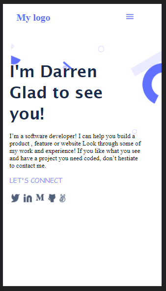

# Portoflio

Screenshot

Additional description about the project and its features.
Microverse project for the development of a Software Engineer Portfolio

## Built With

- HTML, CSS
- .Stylelintrc
- .Hintrc

## Getting Started

**This is an example of how you may give instructions on setting up your project locally.**
**Modify this file to match your project, remove sections that don't apply. For example: delete the testing section if the currect project doesn't require testing.**

To get a local copy up and running follow these simple example steps.

### Prerequisites
You would need a code editor such as vs code for this project

## Authors

👤 **Author1**

- GitHub: [@githubhandle](https://github.com/darrenodi)
- Twitter: [@twitterhandle](https://twitter.com/darrenodi)
- LinkedIn: [LinkedIn](https://www.linkedin.com/in/darren-odi-404ba31b2/)

## 🤝 Contributing

Contributions, issues, and feature requests are welcome!

Feel free to check the [issues page](../../issues/).

## Show your support

Give a ⭐️ if you like this project!

## Acknowledgments

- Hat tip to anyone whose code was used
- Inspiration
- etc

## 📝 License

This project is [MIT](./MIT.md) licensed.
